# DevOps Tooling Website Solution

## Project Overview
3-tier architecture with NFS storage, MySQL database, and multiple web servers.

## Step 1: NFS Server Setup

### 1.1 Create NFS Server EC2 Instance
```bash
# Launch RHEL 8 EC2 instance
# Configure security groups: SSH (22), NFS (111, 2049 TCP/UDP)
```
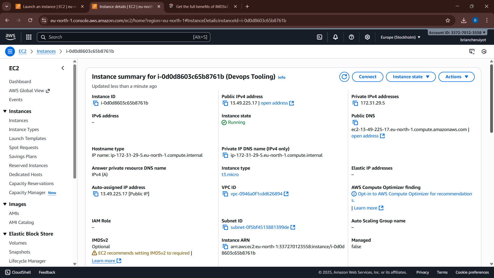

### 1.2 Configure LVM
```bash
# Check available disks
lsblk

# Create physical volumes
sudo pvcreate /dev/xvdf /dev/xvdg /dev/xvdh
```
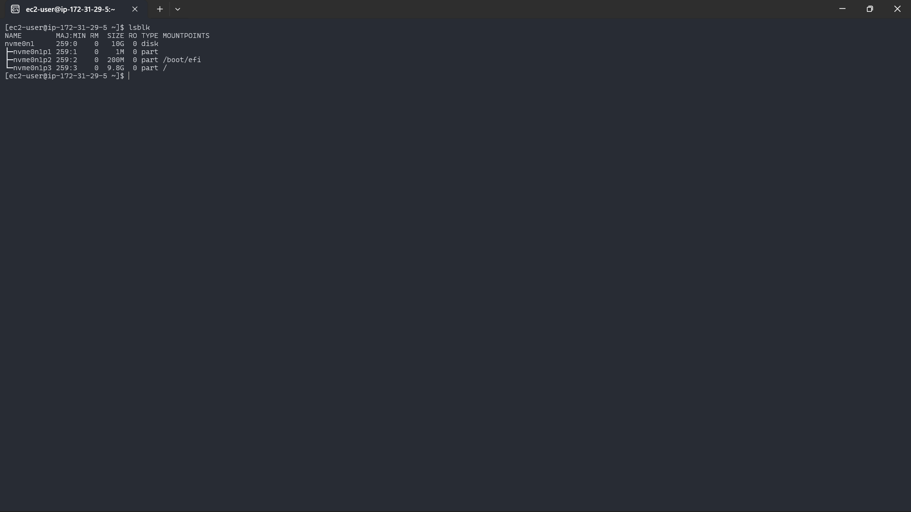
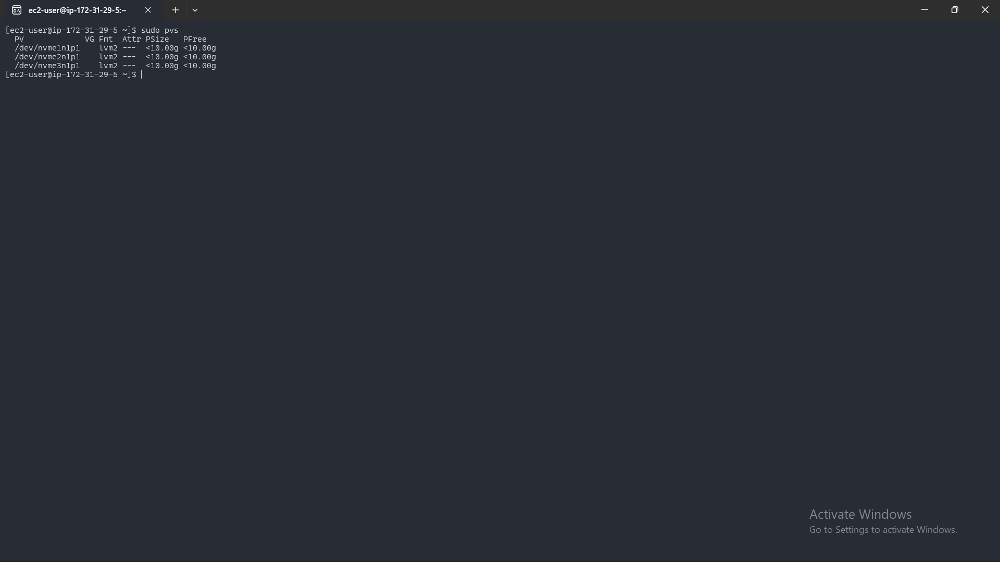

```bash
# Create volume group
sudo vgcreate vg-nfs /dev/xvdf /dev/xvdg /dev/xvdh

# Create logical volumes
sudo lvcreate -L 10G -n lv-apps vg-nfs
sudo lvcreate -L 10G -n lv-logs vg-nfs
sudo lvcreate -L 10G -n lv-opt vg-nfs
```
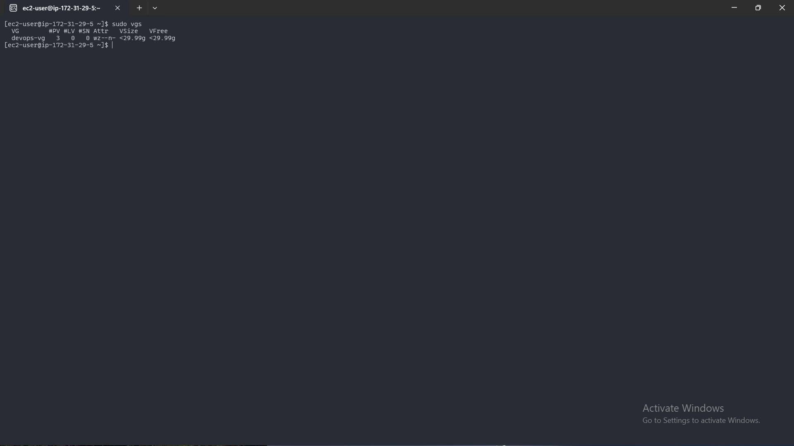
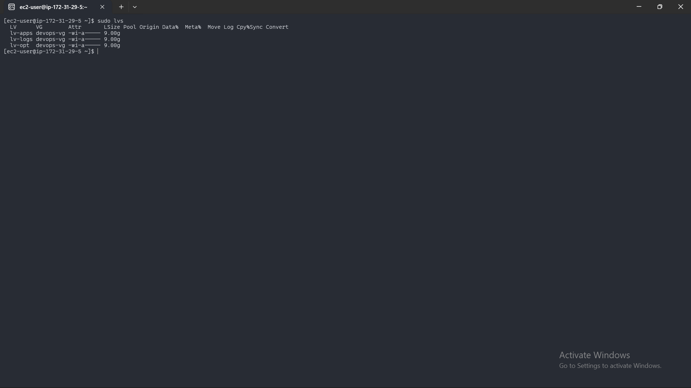

### 1.3 Format and Mount Filesystems
```bash
# Format as XFS
sudo mkfs.xfs /dev/vg-nfs/lv-apps
sudo mkfs.xfs /dev/vg-nfs/lv-logs
sudo mkfs.xfs /dev/vg-nfs/lv-opt

# Create mount points
sudo mkdir -p /mnt/apps /mnt/logs /mnt/opt

# Mount volumes
sudo mount /dev/vg-nfs/lv-apps /mnt/apps
sudo mount /dev/vg-nfs/lv-logs /mnt/logs
sudo mount /dev/vg-nfs/lv-opt /mnt/opt

# Verify mounts
df -h
```
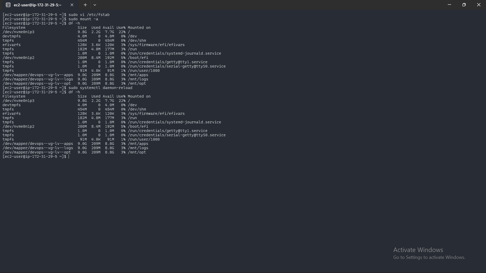
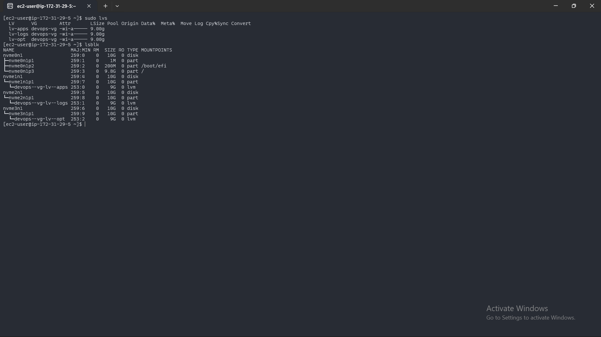

### 1.4 Configure NFS Server
```bash
# Install NFS
sudo yum install nfs-utils -y

# Start and enable NFS
sudo systemctl start nfs-server
sudo systemctl enable nfs-server
sudo systemctl status nfs-server
```
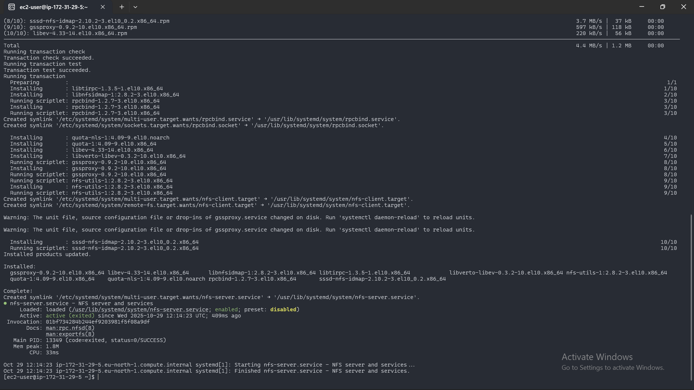

```bash
# Set permissions
sudo chown -R nobody: /mnt/apps /mnt/logs /mnt/opt
sudo chmod -R 777 /mnt/apps /mnt/logs /mnt/opt

# Configure exports
sudo vi /etc/exports
```
Add to `/etc/exports`:
```
/mnt/apps 172.31.0.0/20(rw,sync,no_all_squash,no_root_squash)
/mnt/logs 172.31.0.0/20(rw,sync,no_all_squash,no_root_squash)
/mnt/opt 172.31.0.0/20(rw,sync,no_all_squash,no_root_squash)
```
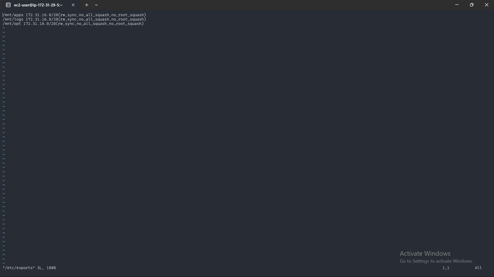

```bash
# Apply exports
sudo exportfs -arv

# Configure security group
# Open ports: 111 TCP/UDP, 2049 TCP/UDP
```
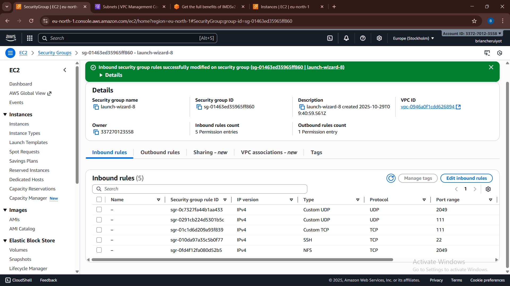

## Step 2: Database Server Setup

### 2.1 Create Database Server
```bash
# Launch Ubuntu 24.04 EC2 instance
# Security group: SSH (22), MySQL (3306) from web servers
```

### 2.2 Install and Configure MySQL
```bash
# Update system
sudo apt update && sudo apt upgrade -y

# Install MySQL
sudo apt install mysql-server -y

# Start and enable MySQL
sudo systemctl start mysql
sudo systemctl enable mysql
sudo systemctl status mysql
```
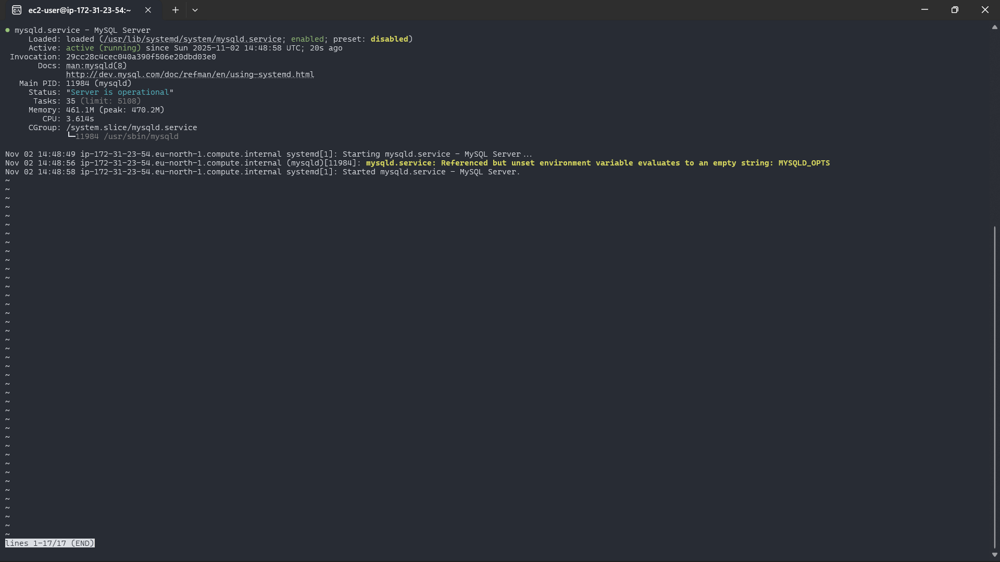

### 2.3 Configure Database
```bash
# Secure MySQL installation
sudo mysql_secure_installation

# Login to MySQL
sudo mysql -u root -p
```

```sql
-- Create database and user
CREATE DATABASE tooling;

CREATE USER 'webaccess'@'%' IDENTIFIED BY 'SecurePassword123!';

GRANT ALL PRIVILEGES ON tooling.* TO 'webaccess'@'%';

FLUSH PRIVILEGES;

EXIT;
```
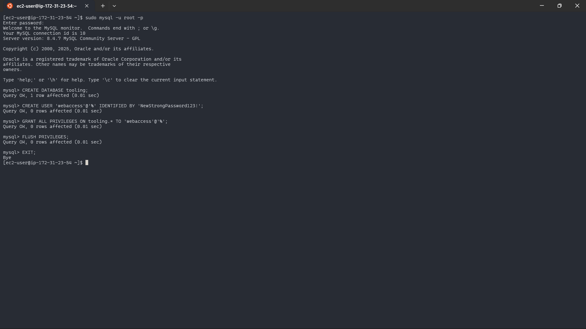

### 2.4 Configure Remote Access
```bash
# Edit MySQL configuration
sudo vi /etc/mysql/mysql.conf.d/mysqld.cnf

# Change bind-address to:
bind-address = 0.0.0.0

# Restart MySQL
sudo systemctl restart mysql
```

## Step 3: Web Servers Setup (Repeat for 3 servers)

### 3.1 Create Web Server Instances
```bash
# Launch 3 RHEL 8 EC2 instances
# Security group: SSH (22), HTTP (80)
```
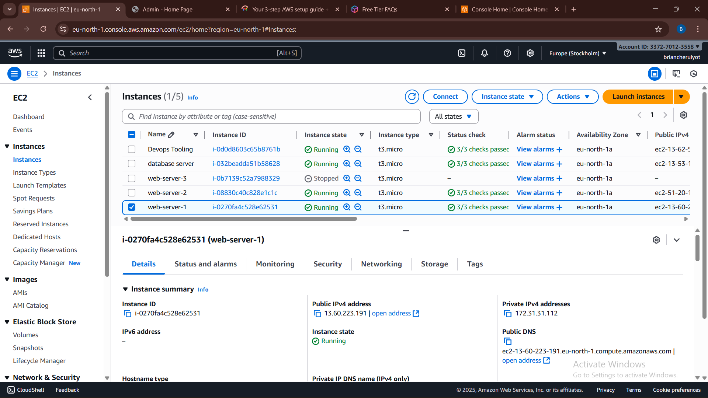

### 3.2 Install NFS Client and Mount Shares
```bash
# Install NFS utilities
sudo yum install nfs-utils nfs4-acl-tools -y

# Create /var/www directory
sudo mkdir /var/www

# Mount NFS share
sudo mount -t nfs -o rw,nosuid 172.31.xx.xx:/mnt/apps /var/www

# Verify mount
df -h
```
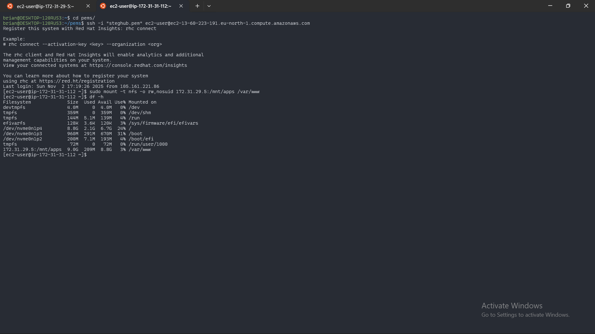

```bash
# Make mount permanent
sudo vi /etc/fstab
```
Add to `/etc/fstab`:
```
172.31.xx.xx:/mnt/apps /var/www nfs defaults 0 0
```
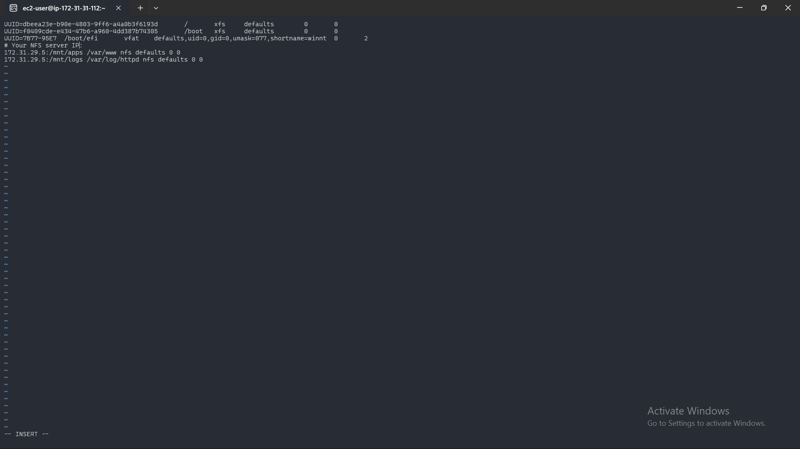

### 3.3 Install Apache and PHP
```bash
# Install Apache
sudo yum install httpd -y

# Start and enable Apache
sudo systemctl start httpd
sudo systemctl enable httpd

# Install EPEL and Remi repositories
sudo dnf install https://dl.fedoraproject.org/pub/epel/epel-release-latest-8.noarch.rpm -y
sudo dnf install dnf-utils http://rpms.remirepo.net/enterprise/remi-release-8.rpm -y

# Install PHP 7.4
sudo dnf module reset php -y
sudo dnf module enable php:remi-7.4 -y
sudo dnf install php php-opcache php-gd php-curl php-mysqlnd -y
sudo dnf install php-fpm -y

# Start PHP-FPM
sudo systemctl start php-fpm
sudo systemctl enable php-fpm

# Set SELinux boolean
sudo setsebool -P httpd_execmem 1
```
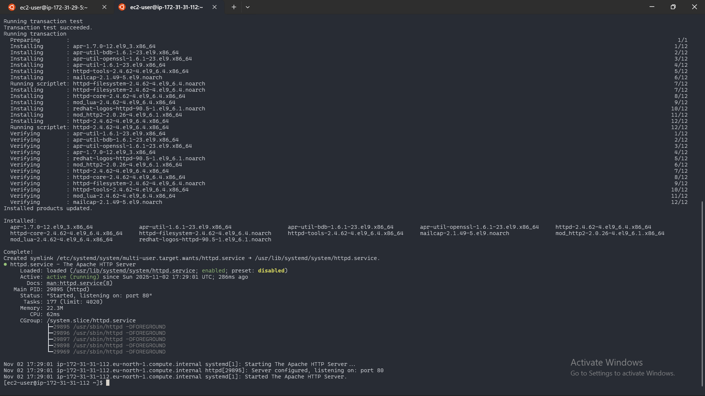

### 3.4 Mount Apache Logs to NFS
```bash
# Stop Apache
sudo systemctl stop httpd

# Mount logs directory
sudo mount -t nfs -o rw,nosuid 172.31.xx.xx:/mnt/logs /var/log/httpd

# Add to fstab
sudo vi /etc/fstab
```
Add to `/etc/fstab`:
```
172.31.xx.xx:/mnt/logs /var/log/httpd nfs defaults 0 0
```

```bash
# Start Apache
sudo systemctl start httpd
```

### 3.5 Deploy Tooling Application
```bash
# Navigate to web directory
cd /var/www

# Clone tooling repository
sudo yum install git -y
sudo git clone https://github.com/your-username/tooling.git

# Copy files to web root
sudo cp -r tooling/html/* /var/www/html/

# Set permissions
sudo chown -R apache:apache /var/www/html/
sudo chmod -R 755 /var/www/html/
```
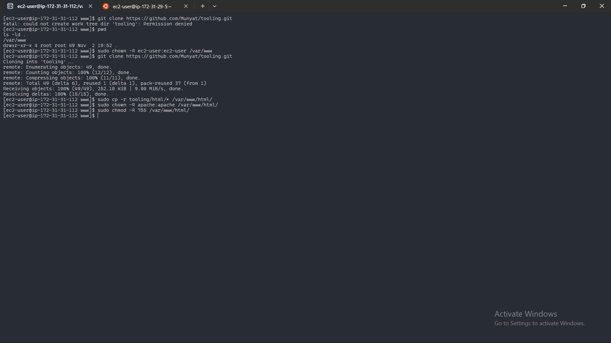

### 3.6 Configure Database Connection
```bash
# Edit database configuration
sudo vi /var/www/html/functions.php
```

Update database connection in `functions.php`:
```php
$dbhost = '172.31.xx.xx';  // Database server private IP
$dbuser = 'webaccess';
$dbpass = 'SecurePassword123!';
$dbname = 'tooling';
```
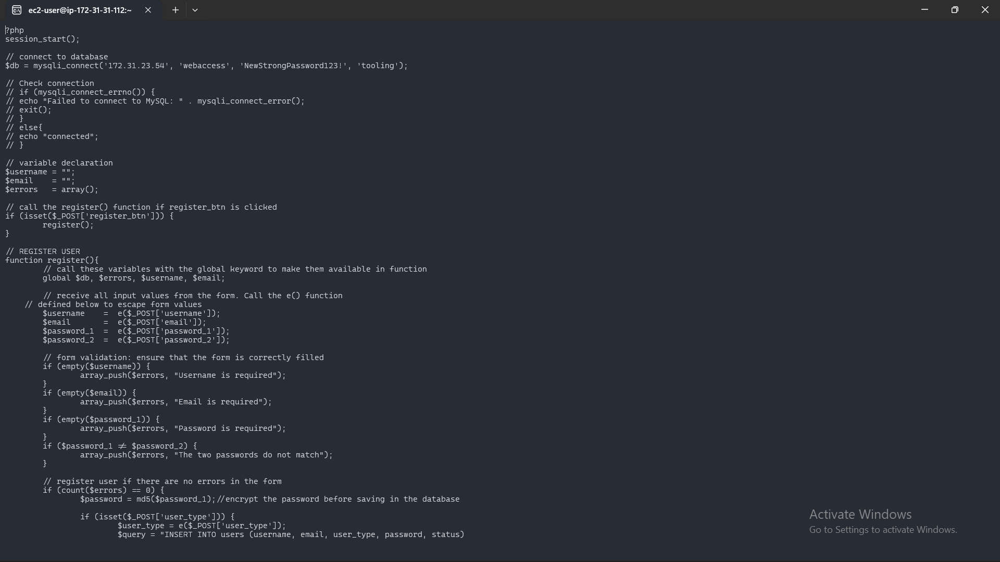

## Step 4: Database Population

### 4.1 Import Database Schema
```bash
# Install MySQL client on web server
sudo yum install mysql -y

# Import schema
cd /var/www/tooling
mysql -h 172.31.xx.xx -u webaccess -p tooling < tooling-db.sql
```

### 4.2 Create Admin User
```bash
# Connect to database
mysql -h 172.31.xx.xx -u webaccess -p

# Run SQL commands
USE tooling;

INSERT INTO `users` (`username`, `password`, `email`, `user_type`, `status`) 
VALUES ('myuser', '5f4dcc3b5aa765d61d8327deb882cf99', 'user@mail.com', 'admin', '1');

SELECT * FROM users WHERE username = 'myuser';
```
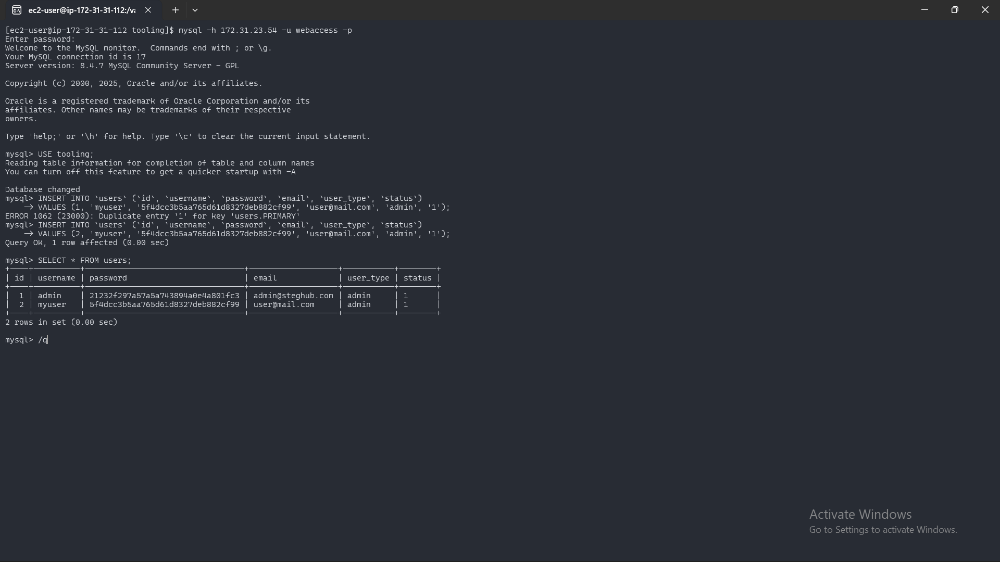

## Step 5: Final Testing

### 5.1 Test Website Access
```bash
# Restart services
sudo systemctl restart httpd
sudo systemctl restart php-fpm

# Test PHP
echo "<?php phpinfo(); ?>" | sudo tee /var/www/html/info.php
```

Visit in browser:
```
http://<web-server-public-ip>/index.php
```
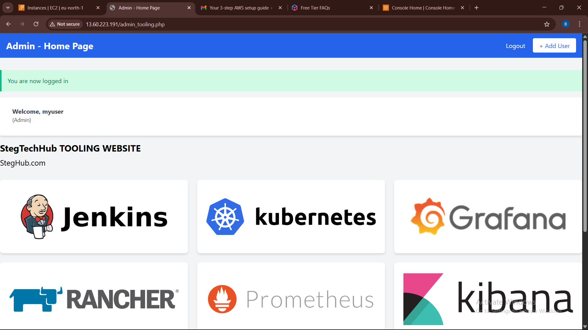

### 5.2 Test Login
- Username: `myuser`
- Password: `password`
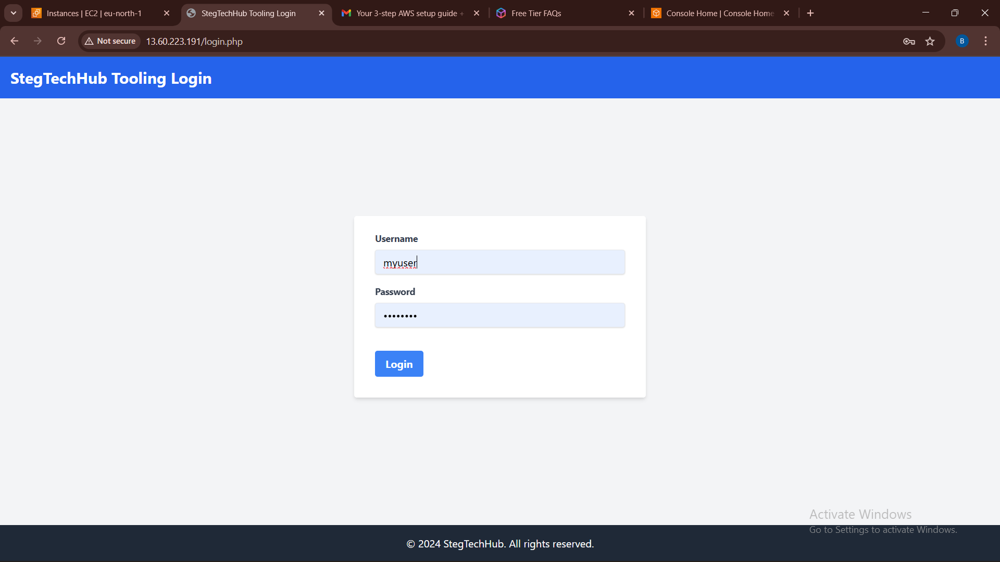

### 5.3 Verify File Sharing
```bash
# Create test file on one web server
sudo touch /var/www/test-from-server1.txt

# Check on other web servers
ls -la /var/www/
```

## Troubleshooting Commands

### Check Services
```bash
sudo systemctl status nfs-server
sudo systemctl status mysql
sudo systemctl status httpd
sudo systemctl status php-fpm
```

### Check Mounts
```bash
df -h
mount | grep nfs
```

### Check Database Connection
```bash
mysql -h 172.31.xx.xx -u webaccess -p -e "SHOW DATABASES;"
```

### Check Logs
```bash
sudo tail -f /var/log/httpd/error_log
sudo tail -f /var/log/mysql/error.log
```

## Security Group Configuration Summary

### NFS Server
- SSH: 22
- NFS: 111 TCP/UDP, 2049 TCP/UDP

### Database Server
- SSH: 22
- MySQL: 3306 (from web servers subnet)

### Web Servers
- SSH: 22
- HTTP: 80 (from your IP)

## Complete Architecture Verification
All 5 servers should be running:
- 1 NFS Server
- 1 Database Server  
- 3 Web Servers

